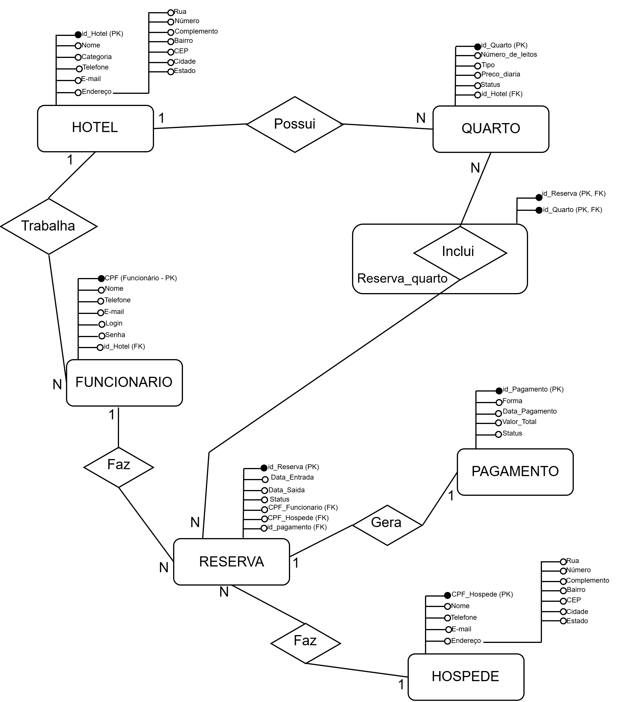

# Projeto de Banco de Dados: Modelagem e Implementação SQL

Este repositório contém a resolução de um projeto prático de Banco de Dados desenvolvido como parte dos meus estudos no curso de **Análise e Desenvolvimento de Sistemas** da **UNINTER**. O projeto é dividido em duas etapas principais: modelagem conceitual de um sistema e implementação de um banco de dados relacional com consultas SQL.

## Tecnologias e Ferramentas
* **Banco de Dados:** MySQL
* **Ferramenta:** MySQL Workbench
* **Linguagem:** SQL (DDL e DML)
* **Conceitos:** Modelagem Entidade-Relacionamento (MER), Chaves Primárias/Estrangeiras, Consultas com `JOIN`, Agregações (`GROUP BY`, `SUM`, `COUNT`).

---

## Etapa 1: Modelagem de Dados (Rede de Hotéis)
A primeira etapa consistiu na criação do **Modelo Entidade-Relacionamento (MER)**, seguindo a notação conceitual clássica, para estruturar as operações de uma rede de hotéis. O foco foi garantir a integridade dos dados e o mapeamento correto das regras de negócio.

**Destaques da Modelagem:**
* **Mapeamento de Entidades e Atributos:** Estruturação das entidades principais (`Hotel`, `Quarto`, `Funcionario`, `Hospede`, `Reserva`, `Pagamento`) com suas respectivas Chaves Primárias (PK) e detalhamento de atributos compostos (ex: decomposição do atributo `Endereço`).
* **Definição de Cardinalidades:** Estabelecimento claro dos relacionamentos de "1 para N" (ex: *Um hóspede faz várias reservas*; *Um hotel possui vários quartos*).
* **Entidade Associativa:** Resolução do relacionamento "N para N" entre `Reserva` e `Quarto` através da criação da entidade associativa `Reserva_quarto`, garantindo que um quarto possa estar em várias reservas ao longo do tempo e uma reserva possa englobar múltiplos quartos.

---

## Etapa 2: Implementação e Consultas SQL (Locadora de Veículos)
A segunda etapa focou na implementação física de um modelo relacional para uma Locadora de Veículos. 

**Ações Realizadas:**
1. **Criação do Banco de Dados (DDL):** Criação das tabelas `Cliente`, `Pagamento`, `Veiculo`, `Locacao`, `LocacaoVeiculo` e `Manutencao` utilizando `CREATE TABLE`, garantindo a integridade referencial com `PRIMARY KEY` e `FOREIGN KEY`.
2. **Consultas Avançadas (DQL):**
   * Listagem do histórico de manutenções com detalhamento de custos e datas.
   * Cálculo do faturamento total da locadora utilizando a função de agregação `SUM()`.
   * Ranqueamento dos modelos de veículos mais alugados utilizando `JOIN`, `COUNT()` e `GROUP BY`.
   * Levantamento de clientes com pagamentos pendentes e seus respectivos valores devidos.

---

## Autor
**Rafael da Silva Lopes** Estudante de Análise e Desenvolvimento de Sistemas | UNINTER
